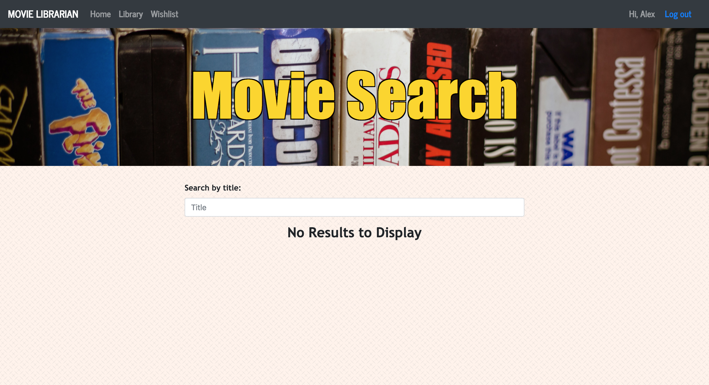
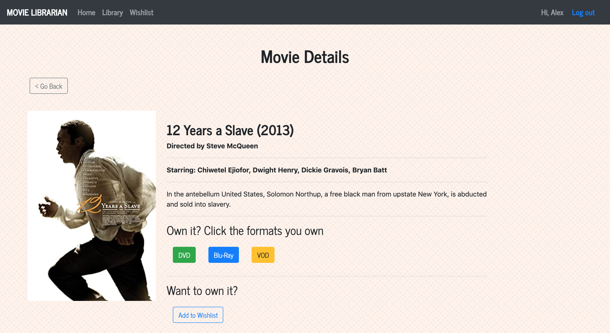
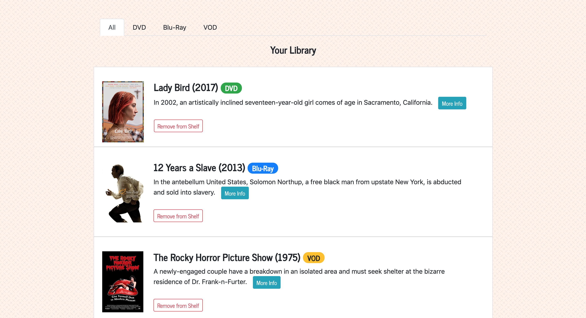
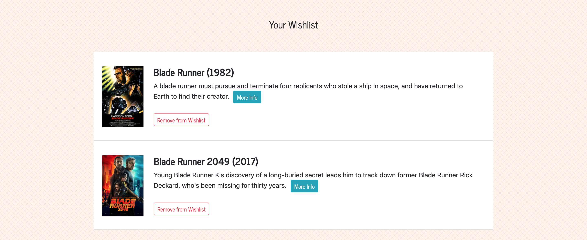

# Your Personal Movie Librarian

## Description
A React Web Application that utilizes MySQL that allows a user to create an account, use the search functionality to look up any movie they want, and add it to a wishlist or a library list. The user can also choose which media format they own the movie on (DVD, Blu-Ray, or VOD), and that is reflected in their library list. The user can also sort for which movies they own on which format.

## User Story

AS A movie buff

I WANT TO be able to catalog the movies I own and sort them by what format I own them on.

SO THAT I can better understand my library of movies, and so that I do not purchase doubles.

## Demo Images

## Deployment
[Deployment w/ Heroku](https://project3-movie-app-2020.herokuapp.com/)
